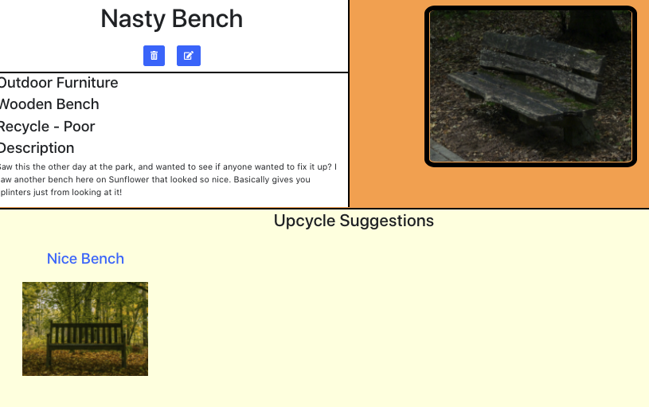

# Sunflower 
https://github.com/Sunflower-Project
## Description
Sunflower is an up-cycling application built with the goal of fostering a community of individuals to reuse and create works of art out of discarded items, or at the very least find new ways to upgrade their existing ones.
- e.g. Taking a faded and worn down table and finding someone else who stained and cleaned up a table similar to yours, making it like-new again.

## Brief Example 
Here is an example of a "recycle" item. You can see it is in poor condition and below is a suggested item to model its "upcycle" after.



## List of Features / User Stories
Bronze (MVP) - **Completed**
- Display a welcome page
- Display all items
- Able to post items
- Able to update items
- Able to delete items
- Able to see suggested items
- Suggested items link to their own pages

### Stretch Goals
Silver - *Incomplete*
- User Authentication
- File upload instead of just URLs
- Create your own profile
- Save items to your profile
- Add a search function
- Add a sort function for browsing items
- Separate between recycle and upcycle pages
- Add a comment feature


Gold - *Incomplete*
- Sign in with Google, Facebook, etc.
- Share links for your items to social media.
- Add direct messaging between users

### Technologies used
- HTML
- CSS
- Javascript
- React.js
- Bootstrap
- FontAwesome Icons
- Python
- PostgreSQL
- Django Rest Framework
- Heroku

### Installation Instructions / Getting Started
To get started on this project:
- Fork and clone this repo, as well as the backend repo https://github.com/Sunflower-Project/back-end
- Install dependencies for both repos
- Ensure you are operating on the correct localhosts (3000 for the front-end, and 8000 for the back-end)

### Contribution Guidelines
- If you'd like to contribute, submit a pull request from your own feature branch and compare to ``` dev ```.

### Links
Organization Repo
- https://github.com/Sunflower-Project

Front-End Repo
- https://github.com/Sunflower-Project/front-end

Front-End Issue Tracker
- https://github.com/Sunflower-Project/front-end/issues

Front-End Pull Requests
- https://github.com/Sunflower-Project/front-end/pulls

Back-End Repo
- https://github.com/Sunflower-Project/back-end

Back-End Issue Tracker
- https://github.com/Sunflower-Project/back-end/issues

Back-End Pull Requests
- https://github.com/Sunflower-Project/back-end/pulls